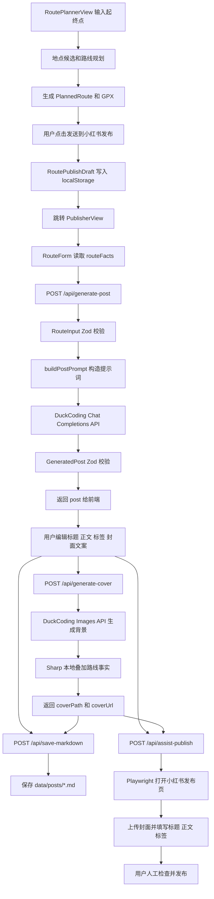
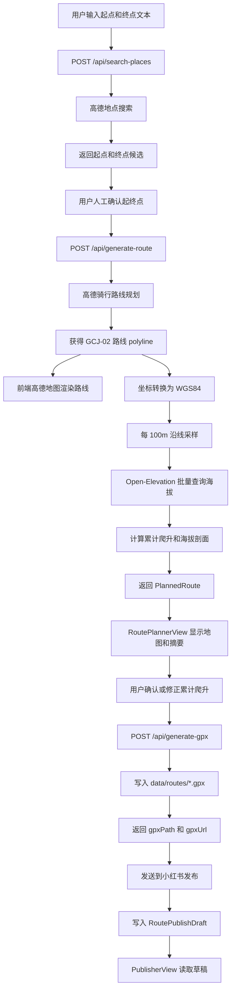
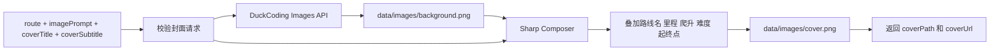

# 成都周边骑行路线发布工具 V2.0 架构设计

## 1. 目标

本项目重构为一个本地运行的 Web 应用，用于辅助生成成都周边骑行路线的小红书发布素材。用户录入路线信息后，系统完成以下工作：

- V2.0 支持用户只输入起点和终点，并从高德地图候选地点中人工确认。
- V2.0 前端拆成“路线规划”和“小红书发布”两个割裂界面，通过顶部导航进入。
- 路线规划界面采用地图优先布局，参考 Strava 路线创建页，地图是第一视觉和主要操作区。
- 小红书发布界面只负责路线事实确认、文案、封面、Markdown 和辅助发布。
- V2.0 使用高德地图生成骑行路线，并在前端地图中渲染路线。
- V2.0 按路线每 100m 采样，通过 Open-Elevation 批量查询海拔，计算累计爬升。
- V2.0 生成可导入 Strava 的 GPX 路书，并提供本地下载。
- 生成结构化小红书文案。
- 生成类似 Strava 风格的封面背景。
- 在本地将路线事实叠加到封面海报。
- 保存最终内容为 Markdown。
- 使用 Playwright 辅助填写小红书桌面端发布页面。

系统不自动发布内容，不保存小红书账号密码，不绕过登录、验证码或平台风控。

## 2. 架构原则

- 前端只负责表单、预览、编辑、状态展示和 API 调用，不承载业务规则。
- 前端页面按 bounded context 拆分：`RoutePlannerView` 负责路线规划，`PublisherView` 负责小红书发布；跨界面只通过 `RoutePublishDraft` 数据包交接。
- 页面导航优先使用成熟路由库 `vue-router`，避免手写 URL 状态管理。
- 路线发布草稿使用单用途 `routePublishDraftStore` 封装 `localStorage`，不把持久化逻辑散落在 Vue 组件中。
- 领域模型使用 Zod 统一校验，包括路线输入、生成文案、封面请求和发布请求。
- AI 调用、图片合成、文件保存、浏览器自动化都放在服务层，通过用例层调用。
- 关键路线事实由用户输入和本地渲染控制，不交给图片模型生成。
- 高德地图、Open-Elevation、DuckCoding OpenAI-compatible API、文件系统、Sharp、Playwright 都隔离在基础设施服务中，便于测试和替换。
- 高德返回的 GCJ-02 坐标只用于高德地图展示；GPX 和 Strava 导入文件必须输出 WGS84 坐标。
- 路线、海拔、GPX 是 V2.0 的上游事实来源；用户仍可人工确认或修正累计爬升、亮点、风险、补给等发布内容。
- 发布辅助永远不点击最终发布按钮。

## 3. 分层设计

```text
Vue Client
  AppNav
  Router
    RoutePlannerView
      RoutePlannerForm
      PlaceCandidateSelector
      RouteMap
      RouteSummaryBar
      GpxDownloadPanel
    PublisherView
      RouteForm
      GeneratedPostEditor
      CoverPreview
      WorkflowActions
  routePublishDraftStore
        |
        | HTTP JSON
        v
Express API
  request logging
  request validation
  route handlers
        |
        v
Application Use Cases
  SearchPlacesUseCase
  GenerateRouteUseCase
  GenerateGpxUseCase
  GeneratePostUseCase
  GenerateCoverUseCase
  SaveMarkdownUseCase
  AssistPublishUseCase
        |
        v
Infrastructure Services
  AMap place search and cycling route API
  AMap JS API route rendering
  GCJ-02 to WGS84 coordinate converter
  Open-Elevation batch API
  GPX route writer
  DuckCoding Chat Completions API (OpenAI-compatible)
  DuckCoding Images API (OpenAI-compatible)
  Sharp cover composer
  File system markdown store
  Playwright Xiaohongshu assistant
```

## 4. 建议目录结构

```text
src/
  client/
    App.vue
    router.ts
    stores/
      routePublishDraftStore.ts
    api/
      publishingApi.ts
    components/
      AppNav.vue
      RoutePlannerForm.vue
      PlaceCandidateSelector.vue
      RouteMap.vue
      RouteSummaryBar.vue
      GpxDownloadPanel.vue
      RouteForm.vue
      GeneratedPostEditor.vue
      CoverPreview.vue
      WorkflowActions.vue
    views/
      RoutePlannerView.vue
      PublisherView.vue
  server/
    app.ts
    index.ts
    config.ts
    logging/
      requestLogger.ts
    domain/
      placeCandidate.ts
      plannedRoute.ts
      elevationProfile.ts
      gpxRoute.ts
      routeInput.ts
      generatedPost.ts
      coverPoster.ts
      publishDraft.ts
      promptBuilder.ts
    useCases/
      searchPlacesUseCase.ts
      generateRouteUseCase.ts
      generateGpxUseCase.ts
      generatePostUseCase.ts
      generateCoverUseCase.ts
      saveMarkdownUseCase.ts
      assistPublishUseCase.ts
    routes/
      searchPlacesRoute.ts
      generateRouteRoute.ts
      generateGpxRoute.ts
      generatePostRoute.ts
      generateCoverRoute.ts
      saveMarkdownRoute.ts
      assistPublishRoute.ts
    services/
      amapPlaceSearch.ts
      amapCyclingRoutePlanner.ts
      coordinateConverter.ts
      routeSampler.ts
      openElevationProvider.ts
      elevationGainCalculator.ts
      gpxRouteWriter.ts
      openaiClient.ts
      openaiPostGenerator.ts
      openaiCoverBackgroundGenerator.ts
      coverPosterComposer.ts
      markdownPostStore.ts
      xiaohongshuPublisher.ts
tests/
  domain/
  useCases/
  routes/
  services/
```

## 5. 主流程数据流图



V2.0 不推翻文案、封面、Markdown 和辅助发布主流程，而是把路线规划阶段独立为 `RoutePlannerView`。路线规划阶段生成的 `PlannedRoute`、`RouteInput`、`gpxPath` 和 `gpxUrl` 通过 `RoutePublishDraft` 交接给 `PublisherView`。

### 5.1 V2.0 路线生成与 GPX 数据流图



V2.0 数据流约束：

- 用户只需要输入起点和终点文本，但必须从候选地点中人工确认最终点位。
- V2.0 暂不支持途经点，领域模型预留 `waypoints` 字段但接口默认传空数组。
- 高德地图展示使用 GCJ-02；GPX、Open-Elevation、Strava 导入使用 WGS84。
- Open-Elevation 按每 100m 采样，批量查询默认每批 100 个点，避免逐点请求。
- 累计爬升按沿路线采样点逐段累加正向海拔变化，不使用终点海拔减起点海拔。
- Open-Elevation 失败时不阻断路线生成，接口返回 `elevation.status = "failed"`，前端提示用户手工填写累计爬升后再生成文案或 GPX。
- GPX 文件必须包含 `<ele>`，只有海拔查询失败且用户确认继续时才允许生成无 `<ele>` 的降级 GPX。

### 5.2 文案生成接口

`/api/generate-post` 使用 DuckCoding 提供的 OpenAI-compatible Chat Completions API。服务层仍使用 OpenAI Node SDK，但必须配置 DuckCoding 的 `baseURL`，并使用 `DUCKCODING_TEXT_API_KEY` 作为文案生成密钥。

```ts
import OpenAI from "openai";

const client = new OpenAI({
  baseURL: process.env.DUCKCODING_BASE_URL ?? "https://www.duckcoding.ai/v1",
  apiKey: process.env.DUCKCODING_TEXT_API_KEY,
});

const completion = await client.chat.completions.create({
  model: process.env.DUCKCODING_TEXT_MODEL ?? "gpt-5.5",
  messages: [{ role: "user", content: buildPostPrompt(route) }],
});

const content = completion.choices[0]?.message?.content;
```

调用约束：

- `messages[0].content` 使用 `buildPostPrompt(route)` 构造，要求模型输出纯 JSON，不输出 Markdown 或解释文字。
- `content` 必须先解析为 JSON，再用 `GeneratedPost` Zod schema 校验。
- 如果 `content` 为空、不是合法 JSON、或不符合 schema，接口返回 `502` 上游生成失败。
- 默认文案模型为 `gpt-5.5`，可通过 `DUCKCODING_TEXT_MODEL` 覆盖。
- 文案生成不得使用图片生成 key；`DUCKCODING_TEXT_API_KEY` 缺失时，`/api/generate-post` 返回上游配置错误。

## 6. 封面生成数据流图



### 6.1 图片生成接口

封面背景生成使用 DuckCoding 提供的 OpenAI-compatible Images API。服务层仍使用 OpenAI Node SDK，但图片客户端必须配置 DuckCoding 的 `baseURL`，并使用 `DUCKCODING_IMAGE_API_KEY` 作为图片生成密钥。

```ts
import OpenAI from "openai";

const client = new OpenAI({
  baseURL: process.env.DUCKCODING_BASE_URL ?? "https://www.duckcoding.ai/v1",
  apiKey: process.env.DUCKCODING_IMAGE_API_KEY,
});

const response = await client.images.generate({
  model: process.env.DUCKCODING_IMAGE_MODEL ?? "gpt-image-1",
  prompt,
  size: process.env.DUCKCODING_IMAGE_SIZE ?? "1024x1536",
  n: 1,
});
```

调用约束：

- `prompt` 来自 `GeneratedPost.imagePrompt`，并追加骑行俱乐部小红书海报风格约束。
- 背景应是竖版全屏实拍感骑行海报，可包含山路、海岸公路、森林公路、远山、骑行者剪影、骑行队伍、晨昏光影、雾气、动感模糊或强烈阴影。
- 背景需要保留大块干净区域，便于本地叠加白色大标题和路线数据。
- 背景可使用胶片颗粒、光晕、笔刷动势、轻微拼贴感，形成小红书骑行俱乐部活动海报质感。
- 背景不得生成地图、路线轨迹、等高线、地理纹理、UI 元素、logo、水印、可读文字或数字。
- 图片接口只负责生成背景图，路线名、里程、爬升、难度、起终点等关键事实必须由本地 Sharp 合成。
- 本地 Sharp 合成应采用全屏压图排版：白色大标题、顶部小型路线/俱乐部标识区、中部手绘感路线线条、底部路线事实信息，不使用深色信息卡片。
- 默认模型为 `gpt-image-1`，默认背景生成尺寸为 `1024x1536`，默认生成数量为 `1`。
- 本地 Sharp 最终合成海报固定输出为小红书常用竖图尺寸 `1080x1440`，比例为 `3:4`。
- 如果响应包含 `b64_json`，服务层直接写入 `data/images/background-*.png`；如果响应包含图片 URL，服务层下载后再写入本地文件。
- 图片生成不得使用文案生成 key；`DUCKCODING_IMAGE_API_KEY` 缺失时，`/api/generate-cover` 返回上游配置错误。

## 7. 核心领域模型

### 7.1 PlaceCandidate

高德地点搜索返回的候选点。前端必须展示候选列表，让用户确认后才能规划路线。

| 字段 | 类型 | 必填 | 说明 |
|---|---:|---:|---|
| `id` | string | 是 | 高德 POI id；没有 POI id 时使用稳定派生 id |
| `name` | string | 是 | 地点名称 |
| `address` | string | 否 | 地址或区域说明 |
| `city` | string | 否 | 城市 |
| `district` | string | 否 | 区县 |
| `location.gcj02.lng` | number | 是 | 高德 GCJ-02 经度 |
| `location.gcj02.lat` | number | 是 | 高德 GCJ-02 纬度 |
| `source` | string | 是 | 固定为 `amap` |

### 7.2 PlannedRoute

路线规划结果，是 V2.0 后续文案、封面、Markdown 和 GPX 的事实来源。

| 字段 | 类型 | 必填 | 说明 |
|---|---:|---:|---|
| `routeId` | string | 是 | 本地生成的路线 id |
| `routeName` | string | 是 | 根据起终点生成的默认路线名，可编辑 |
| `start` | PlaceCandidate | 是 | 用户确认的起点 |
| `end` | PlaceCandidate | 是 | 用户确认的终点 |
| `waypoints` | PlaceCandidate[] | 是 | V2.0 固定为空数组，为后续多点规划预留 |
| `distanceKm` | number | 是 | 高德路线距离，单位 km |
| `estimatedDurationMin` | number | 否 | 高德估算骑行耗时，单位分钟 |
| `polylineGcj02` | Coordinate[] | 是 | 用于高德地图渲染的 GCJ-02 路线 |
| `polylineWgs84` | Coordinate[] | 是 | 用于 GPX 和 Open-Elevation 的 WGS84 路线 |
| `elevation` | ElevationProfile | 是 | 海拔查询和累计爬升结果 |
| `routeFacts` | RouteInput | 是 | 自动填充到现有发布表单的路线事实 |

`Coordinate` 结构：

| 字段 | 类型 | 必填 | 说明 |
|---|---:|---:|---|
| `lng` | number | 是 | 经度 |
| `lat` | number | 是 | 纬度 |

### 7.3 ElevationProfile

| 字段 | 类型 | 必填 | 说明 |
|---|---:|---:|---|
| `status` | string | 是 | `success`、`partial` 或 `failed` |
| `sampleIntervalM` | number | 是 | 默认 `100` |
| `batchSize` | number | 是 | 默认 `100` |
| `gainNoiseThresholdM` | number | 是 | 默认 `3`，过滤小幅海拔噪声 |
| `points` | ElevationPoint[] | 是 | 含距离、坐标和海拔的采样点 |
| `elevationGainM` | number | 否 | 累计爬升，失败时为空 |
| `error` | string | 否 | 海拔查询失败原因，需脱敏 |

`ElevationPoint` 结构：

| 字段 | 类型 | 必填 | 说明 |
|---|---:|---:|---|
| `distanceM` | number | 是 | 沿路线累计距离 |
| `lng` | number | 是 | WGS84 经度 |
| `lat` | number | 是 | WGS84 纬度 |
| `ele` | number | 否 | 海拔，单位米 |

### 7.4 GpxRoute

| 字段 | 类型 | 必填 | 说明 |
|---|---:|---:|---|
| `routeId` | string | 是 | 来源路线 id |
| `name` | string | 是 | GPX 路线名 |
| `points` | ElevationPoint[] | 是 | WGS84 坐标点，成功时包含海拔 |
| `gpxPath` | string | 是 | 本地保存路径 |
| `gpxUrl` | string | 是 | 前端下载路径 |
| `stravaCompatible` | boolean | 是 | 是否满足 Strava 导入要求 |

### 7.5 RouteInput

| 字段 | 类型 | 必填 | 规则 |
|---|---:|---:|---|
| `routeName` | string | 是 | 非空 |
| `startPoint` | string | 是 | 非空 |
| `endPoint` | string | 是 | 非空 |
| `distanceKm` | number | 是 | 大于 0 |
| `elevationGainM` | number | 是 | 大于等于 0 |
| `difficulty` | string | 是 | 非空 |
| `roadType` | string | 是 | 非空 |
| `highlights` | string[] | 是 | 至少 1 项，清洗空白项 |
| `warnings` | string[] | 是 | 至少 1 项，清洗空白项 |
| `supplyPoints` | string[] | 是 | 至少 1 项，清洗空白项 |
| `bestSeason` | string | 否 | 非空字符串 |
| `bestStartTime` | string | 否 | 非空字符串 |
| `targetRiders` | string | 否 | 非空字符串 |
| `transportation` | string | 否 | 非空字符串 |
| `estimatedDuration` | string | 否 | 非空字符串 |
| `photoSpots` | string[] | 否 | 清洗空白项 |
| `foodRecommendations` | string[] | 否 | 清洗空白项 |
| `userHashtags` | string[] | 否 | 清洗空白项 |
| `extraNotes` | string | 否 | 非空字符串 |

V2.0 中 `RouteInput` 仍是文案和封面链路的输入模型，但它优先由 `PlannedRoute.routeFacts` 自动填充。用户可以在前端继续编辑 `difficulty`、`roadType`、`highlights`、`warnings`、`supplyPoints` 等字段。

### 7.6 RoutePublishDraft

`RoutePublishDraft` 是前端路线规划界面和小红书发布界面的交接模型。它不需要新增后端 API，默认由前端 `routePublishDraftStore` 写入 `localStorage`。

| 字段 | 类型 | 必填 | 说明 |
|---|---:|---:|---|
| `plannedRoute` | PlannedRoute | 是 | 路线规划完整结果 |
| `routeFacts` | RouteInput | 是 | 发布表单初始路线事实 |
| `gpxPath` | string | 否 | 本地 GPX 文件路径 |
| `gpxUrl` | string | 否 | 前端 GPX 下载地址 |
| `updatedAt` | string | 是 | ISO 时间戳，用于判断草稿新旧 |

约束：

- 只有用户点击“发送到小红书发布”时才写入。
- `PublisherView` 读取草稿后填充 `RouteForm`。
- 如果 `PublisherView` 已存在用户编辑内容，不得静默覆盖，应弹出确认或保留当前内容。
- `localStorage` 只保存非敏感路线和发布草稿，不保存 API key、cookie、账号密码或小红书登录状态。

### 7.7 GeneratedPost

| 字段 | 类型 | 必填 | 说明 |
|---|---:|---:|---|
| `titleCandidates` | string[] | 是 | 3 个标题候选 |
| `body` | string | 是 | 小红书正文 |
| `guide` | string | 是 | 路线攻略 |
| `easterEgg` | string | 是 | 路线彩蛋 |
| `hashtags` | string[] | 是 | 话题标签，至少 3 个 |
| `coverTitle` | string | 是 | 封面主标题 |
| `coverSubtitle` | string | 是 | 封面副标题 |
| `imagePrompt` | string | 是 | 无最终中文文字的背景图提示词 |

## 8. 前端 GUI 设计

### 8.1 设计目标

前端是本地工作台界面，不做营销落地页。V2.0 将路线规划和小红书发布拆成两个割裂界面，避免地图工具和内容编辑互相干扰。两个界面通过顶部导航进入，并通过 `RoutePublishDraft` 明确交接数据。

设计目标：

- 路线规划界面参考 Strava 路线创建页，地图是第一视觉和主要操作区。
- 小红书发布界面专注路线事实确认、文案编辑、封面预览、Markdown 保存和辅助发布。
- 让用户只输入起点和终点，即可生成路线、地图预览、累计爬升和 GPX 路书。
- 让用户通过明确动作把路线规划结果发送到小红书发布界面。
- 让 AI 生成结果可预览、可编辑、可保存。
- 明确展示当前流程状态，避免重复点击导致重复消耗上游 AI 额度。
- 所有错误都在所属界面可见，并保留后端终端日志作为排查依据。

### 8.2 页面布局

推荐使用路由化双界面布局：

```text
┌──────────────────────────────────────────────────────────────┐
│ AppNav：路线规划 | 小红书发布 | 后续扩展入口                  │
├──────────────────────────────────────────────────────────────┤
│ /route-planner                                                │
│  全屏或近全屏地图                                             │
│  左侧浮层：起终点搜索、候选确认、生成路线                     │
│  底部浮层：距离、累计爬升、耗时、GPX 状态和下载               │
│  右上角：重新规划、生成 GPX、发送到小红书发布                 │
├──────────────────────────────────────────────────────────────┤
│ /publisher                                                    │
│  路线事实表单 | 文案编辑器 | 封面预览 | 发布动作              │
└──────────────────────────────────────────────────────────────┘
```

移动端或窄屏时改为单列：

```text
AppNav
/route-planner:
  地图
  路线面板
  路线摘要
  GPX 下载
/publisher:
  路线事实表单
  文案编辑
  封面预览
  保存和辅助发布
```

### 8.3 组件职责

| 组件 | 职责 | 不负责 |
|---|---|---|
| `App.vue` | 挂载导航和路由出口 | 串联具体业务流程 |
| `AppNav.vue` | 展示顶部导航、当前界面高亮和入口扩展位 | 保存业务状态、调用 API |
| `router.ts` | 定义 `/route-planner`、`/publisher` 和默认跳转 | 页面业务逻辑 |
| `RoutePlannerView.vue` | 维护路线规划上下文、调用地点搜索、路线生成和 GPX API | 小红书文案编辑、封面生成 |
| `PublisherView.vue` | 读取 `RoutePublishDraft`，维护发布上下文，调用文案、封面、保存和辅助发布 API | 地点搜索、路线规划 |
| `routePublishDraftStore.ts` | 读写最近一次路线发布草稿，封装 `localStorage` | 校验后端领域模型、保存敏感信息 |
| `RoutePlannerForm.vue` | 输入起点和终点文本，触发候选地点查询 | 调用高德 SDK、保存 GPX |
| `PlaceCandidateSelector.vue` | 展示起点和终点候选，记录用户确认的点位 | 自动选择模糊地点 |
| `RouteMap.vue` | 用高德 JS API 展示规划路线、起终点和路线状态 | 计算 GPX 坐标、调用后端 |
| `GpxDownloadPanel.vue` | 展示 GPX 生成状态、下载链接和 Strava 导入提示 | 生成路线或编辑文案 |
| `RouteSummaryBar.vue` | 展示距离、累计爬升、耗时、海拔状态和 GPX 状态 | 调用 API、修改路线事实 |
| `RouteForm.vue` | 展示并编辑路线事实，将 textarea 转为字符串数组 | 调用 API、生成提示词 |
| `GeneratedPostEditor.vue` | 展示并编辑 AI 生成结果、选择标题 | 调用上游 AI、保存文件 |
| `CoverPreview.vue` | 展示封面图、封面加载状态、封面错误 | 生成封面 |
| `WorkflowActions.vue` | 展示操作按钮和禁用状态 | 保存业务状态 |
| `publishingApi.ts` | 封装前端 API 请求、统一解析错误 | 页面渲染 |

### 8.4 V2.0 路线规划区

路线规划区位于 `/route-planner`，采用地图优先布局。该界面不展示小红书文案编辑器、不展示封面预览，也不提供 Markdown 或辅助发布按钮。

| 区块 | 控件 | 说明 |
|---|---|---|
| 地图主区域 | 高德地图容器 | 全屏或近全屏展示成都周边地图，生成后绘制骑行路线 |
| 左侧浮层路线面板 | 起点、终点、城市、候选确认 | 表单浮在地图上，便于边看地图边规划 |
| 底部路线摘要条 | 距离、累计爬升、预计耗时、GPX 状态 | 参考 Strava 的路线指标呈现方式 |
| 右上角操作区 | 重新规划、生成 GPX、发送到小红书发布 | 所有动作都必须显式触发 |

交互规则：

- 起点或终点文本变化后，原候选选择、规划路线和 GPX 状态都应标记为过期。
- 用户必须人工确认起点和终点候选，不能默认使用第一条候选直接规划。
- 路线生成成功后，`RoutePlannerView` 保存 `plannedRoute` 和 `plannedRoute.routeFacts`。
- 海拔查询失败时，累计爬升字段保持可编辑，并显示海拔失败详情。
- GPX 下载按钮只有在路线已生成后启用；海拔失败时需用户确认是否生成无海拔 GPX。
- “发送到小红书发布”只有在已有 `plannedRoute` 时启用；如果已生成 GPX，则草稿一并携带 `gpxPath` 和 `gpxUrl`。
- 发送成功后写入 `RoutePublishDraft`，再跳转到 `/publisher`。

### 8.5 小红书发布区

小红书发布区位于 `/publisher`，采用内容编辑工作台布局。该界面不承担地点搜索、路线规划和地图操作职责。

`PublisherView` 进入时：

- 优先读取 `routePublishDraftStore` 中最近一次草稿。
- 如果存在草稿，使用 `draft.routeFacts` 初始化 `RouteForm`，并保留 `draft.gpxPath`。
- 如果不存在草稿，展示空状态，提示用户先到路线规划界面生成路线，或手工填写路线事实。
- 如果当前发布页已有编辑内容且用户再次导入路线草稿，不得静默覆盖。

发布区包含：

| 区块 | 组件 | 说明 |
|---|---|---|
| 路线事实 | `RouteForm.vue` | 展示并编辑由路线规划输出的发布事实 |
| 文案生成和编辑 | `GeneratedPostEditor.vue` | 生成后可编辑标题、正文、攻略、彩蛋、标签、封面文字和图片提示词 |
| 封面预览 | `CoverPreview.vue` | 展示封面生成状态和结果 |
| 发布动作 | `WorkflowActions.vue` | 生成文案、生成封面、保存 Markdown、辅助发布 |
| GPX 引用 | `GpxDownloadPanel.vue` 或轻量链接 | 展示从草稿带来的 GPX 下载入口 |

### 8.6 路线表单设计

路线表单只出现在小红书发布界面。它按分组展示，避免所有字段堆在一起。

| 分组 | 字段 |
|---|---|
| 基础路线 | 路线名称、起点、终点或折返点 |
| 数据指标 | 总里程、累计爬升、难度、路况类型 |
| 必填内容 | 路线亮点、风险提醒和安全注意事项、补给点 |
| 推荐信息 | 推荐季节、推荐出发时间、适合人群、交通建议、预计耗时 |
| 补充内容 | 拍照点、美食推荐、用户指定话题标签、其他补充说明 |

列表类字段使用 textarea，每行一项：

- 路线亮点
- 风险提醒和安全注意事项
- 补给点
- 拍照点
- 美食推荐
- 用户指定话题标签

数字字段使用 number input：

- `distanceKm`：允许小数，最小值大于 0。
- `elevationGainM`：整数，最小值 0。

V2.0 自动填充字段：

| 字段 | 来源 |
|---|---|
| 路线名称 | 起点和终点组合，可编辑 |
| 起点 | 用户确认的高德候选点 |
| 终点 | 用户确认的高德候选点 |
| 总里程 | 高德骑行路线距离 |
| 累计爬升 | Open-Elevation 采样后计算 |
| 预计耗时 | 高德骑行路线估算耗时 |

用户可以继续编辑上述字段。最终用于文案、封面、Markdown 的值以 `PublisherView` 中当前表单值为准，不回写路线规划界面的 `plannedRoute`。

### 8.7 生成内容编辑区

`GeneratedPostEditor` 在 `/api/generate-post` 成功后显示。内容必须允许用户编辑，避免 AI 生成结果未经审核直接进入保存或发布流程。

| 区块 | 控件 | 说明 |
|---|---|---|
| 标题候选 | 单选列表或分段控件 | 从 3 个标题中选择一个作为 `selectedTitle` |
| 正文 | textarea | 可编辑小红书正文 |
| 攻略 | textarea | 可编辑路线攻略 |
| 彩蛋 | textarea | 可编辑路线彩蛋 |
| 话题标签 | 标签输入或 textarea | 支持增删标签 |
| 封面文字 | input | `coverTitle` 和 `coverSubtitle` |
| 图片提示词 | textarea | 可编辑 `imagePrompt`，用于封面背景生成 |

### 8.8 封面预览区

`CoverPreview` 位于小红书发布界面，便于用户在生成和编辑过程中持续看到封面状态。

| 状态 | 展示 |
|---|---|
| 未生成 | 空状态，占位文字为“尚未生成封面” |
| 生成中 | loading 状态，按钮禁用 |
| 成功 | 显示封面图片，展示 `coverPath` |
| 失败 | 显示错误摘要，详情来自 API `detail` |

封面图建议使用稳定比例容器：

```text
宽高比：3:4 或 1080:1440
最大宽度：侧栏宽度
背景：浅灰
```

### 8.9 操作按钮和启用规则

| 按钮 | 启用条件 | 调用 API | 成功后 |
|---|---|---|---|
| 查询候选地点 | 起点和终点文本非空，且无其他请求进行中 | `/api/search-places` | 展示起终点候选列表 |
| 生成骑行路线 | 起点和终点候选均已确认，且无其他请求进行中 | `/api/generate-route` | 展示地图路线，填充路线事实 |
| 生成 GPX 路书 | 已有 `PlannedRoute`，且无其他请求进行中 | `/api/generate-gpx` | 展示 `gpxPath` 和下载链接 |
| 发送到小红书发布 | 已有 `PlannedRoute`，且无其他请求进行中 | 无后端 API | 写入 `RoutePublishDraft` 并跳转 `/publisher` |
| AI 生成 | 路线表单基础校验通过，且无其他请求进行中 | `/api/generate-post` | 填充生成内容，清空旧封面和 Markdown 路径 |
| 生成封面海报 | 已有 `GeneratedPost`，且无其他请求进行中 | `/api/generate-cover` | 更新 `coverPath` |
| 保存 Markdown | 已有 `GeneratedPost`，且无其他请求进行中 | `/api/save-markdown` | 展示 `markdownPath` |
| 辅助发布 | 已有 `GeneratedPost`、`selectedTitle`、`coverPath`，且无其他请求进行中 | `/api/assist-publish` | 展示辅助发布已启动 |

所有按钮请求期间必须禁用，避免重复请求造成重复扣费或重复写文件。

### 8.10 页面状态模型

前端状态按视图拆分，避免 `App.vue` 成为大而全状态容器。

```ts
type LoadingAction =
  | ""
  | "searchPlaces"
  | "generateRoute"
  | "generateGpx"
  | "generatePost"
  | "generateCover"
  | "saveMarkdown"
  | "assistPublish";

type RoutePlannerState = {
  placeQuery: { start: string; end: string };
  startCandidates: PlaceCandidate[];
  endCandidates: PlaceCandidate[];
  selectedStart: PlaceCandidate | null;
  selectedEnd: PlaceCandidate | null;
  plannedRoute: PlannedRoute | null;
  gpxPath: string;
  gpxUrl: string;
  loadingAction: LoadingAction;
  errorMessage: string;
  errorDetail?: string;
};

type PublisherState = {
  route: RouteFormValue;
  generatedPost: GeneratedPost | null;
  selectedTitle: string;
  coverPath: string;
  markdownPath: string;
  loadingAction: LoadingAction;
  errorMessage: string;
  errorDetail?: string;
};
```

`RoutePublishDraft` 存储 API：

```ts
type RoutePublishDraftStore = {
  read: () => RoutePublishDraft | null;
  write: (draft: RoutePublishDraft) => void;
  clear: () => void;
};
```

错误展示规则：

- `errorMessage` 显示在当前视图内。
- `errorDetail` 可折叠展示，便于复制排查。
- API 返回 `detail` 时必须展示。
- 不在前端展示 API key、authorization、cookie 等敏感信息。

### 8.11 视觉风格

整体界面应偏工作台，不做营销视觉。路线规划页允许地图全屏化和工具浮层，但不得做装饰性 hero。

建议风格：

- 背景使用浅灰或白色。
- 面板边框使用低对比度灰色。
- 主按钮使用骑行/运动感的橙色或红橙色。
- 表单布局紧凑，字段标签清晰。
- 卡片圆角不超过 8px。
- 路线规划页地图为主，浮层面板应紧凑、半透明或白底低阴影，不遮挡主要路线。
- 发布页信息密度高，优先使用分组表单和稳定预览区域。
- 避免大面积渐变、装饰性图形和纯视觉占位。
- 文字大小按工作台密度控制，标题不过度放大。

封面海报不受工作台 UI 的克制风格限制。封面应参考骑行俱乐部小红书活动海报：全屏实拍感背景、强对比白色大标题、顶部小品牌/路线标识、中部手绘路线线条、底部路线数据。封面不得使用深色信息卡片包裹全部文字。

### 8.12 前端 API 错误处理

`publishingApi.ts` 统一处理响应：

- 成功时返回 JSON。
- 失败时读取 `{ error, detail, issues }`。
- 抛出包含 `message` 和 `detail` 的前端错误对象。

前端显示优先级：

```text
detail 存在：显示 error + detail
detail 不存在：显示 error
error 不存在：显示“请求失败”
```

## 9. API 定义

### 9.1 API 总览

| API | 方法 | 作用 | 成功响应 | 主要失败 |
|---|---|---|---|---|
| `/api/health` | GET | 健康检查 | `{ ok: true }` | 无 |
| `/api/search-places` | POST | 使用高德搜索起点和终点候选地点 | `{ startCandidates, endCandidates }` | `400` 输入错误，`502` 高德搜索失败 |
| `/api/generate-route` | POST | 使用高德生成骑行路线，查询海拔并计算累计爬升 | `{ route }` | `400` 输入错误，`502` 高德路线失败 |
| `/api/generate-gpx` | POST | 生成可导入 Strava 的 GPX 路书 | `{ gpxPath, gpxUrl, stravaCompatible }` | `400` 输入错误，`500` 写入失败 |
| `/media/routes/:filename` | GET | 下载本地 GPX 路书文件 | GPX 文件 | `404` 文件不存在 |
| `/api/generate-post` | POST | 根据路线生成小红书文案和封面提示词 | `{ post }` | `400` 输入错误，`502` AI 错误 |
| `/api/generate-cover` | POST | 使用 DuckCoding Images API 生成封面背景并本地合成海报 | `{ coverPath, coverUrl }` | `400` 输入错误，`502` 图片生成失败，`500` 合成失败 |
| `/api/save-markdown` | POST | 保存最终内容为 Markdown | `{ markdownPath }` | `400` 输入错误，`500` 写入失败 |
| `/api/assist-publish` | POST | 启动小红书发布辅助 | `{ ok: true }` | `400` 输入错误，`500` 浏览器自动化失败 |

### 9.2 GET `/api/health`

响应：

| 字段 | 类型 | 说明 |
|---|---:|---|
| `ok` | boolean | 服务是否可用 |

示例：

```json
{
  "ok": true
}
```

### 9.3 POST `/api/search-places`

请求参数：

| 字段 | 类型 | 必填 | 说明 |
|---|---:|---:|---|
| `startQuery` | string | 是 | 起点搜索文本 |
| `endQuery` | string | 是 | 终点搜索文本 |
| `city` | string | 否 | 城市过滤，成都周边默认可为空或 `成都` |
| `limit` | number | 否 | 每组候选数量，默认 `5`，最大 `10` |

响应：

| 字段 | 类型 | 说明 |
|---|---:|---|
| `startCandidates` | PlaceCandidate[] | 起点候选地点 |
| `endCandidates` | PlaceCandidate[] | 终点候选地点 |

示例：

```json
{
  "startCandidates": [
    {
      "id": "B001",
      "name": "成都东站",
      "address": "成都市成华区",
      "city": "成都市",
      "district": "成华区",
      "location": { "gcj02": { "lng": 104.141, "lat": 30.630 } },
      "source": "amap"
    }
  ],
  "endCandidates": [
    {
      "id": "B002",
      "name": "青城山",
      "address": "都江堰市青城山镇",
      "city": "成都市",
      "district": "都江堰市",
      "location": { "gcj02": { "lng": 103.570, "lat": 30.905 } },
      "source": "amap"
    }
  ]
}
```

### 9.4 POST `/api/generate-route`

请求参数：

| 字段 | 类型 | 必填 | 说明 |
|---|---:|---:|---|
| `start` | PlaceCandidate | 是 | 用户确认的起点 |
| `end` | PlaceCandidate | 是 | 用户确认的终点 |
| `waypoints` | PlaceCandidate[] | 否 | V2.0 暂不启用，默认空数组 |
| `sampleIntervalM` | number | 否 | 海拔采样间隔，默认 `100` |
| `elevationBatchSize` | number | 否 | Open-Elevation 每批点数，默认 `100` |

响应：

| 字段 | 类型 | 说明 |
|---|---:|---|
| `route` | PlannedRoute | 规划路线、坐标、海拔、路线事实 |

错误处理：

- 高德路线规划失败返回 `502`。
- Open-Elevation 失败时优先返回 `200`，但 `route.elevation.status` 为 `failed`，并携带 `route.elevation.error`。
- 如果高德路线为空、距离为 0 或坐标不可用，返回 `502`。

示例响应摘录：

```json
{
  "route": {
    "routeId": "route_20260604_001",
    "routeName": "成都东站到青城山",
    "distanceKm": 82.4,
    "estimatedDurationMin": 318,
    "polylineGcj02": [{ "lng": 104.141, "lat": 30.63 }],
    "polylineWgs84": [{ "lng": 104.139, "lat": 30.632 }],
    "elevation": {
      "status": "success",
      "sampleIntervalM": 100,
      "batchSize": 100,
      "gainNoiseThresholdM": 3,
      "points": [{ "distanceM": 0, "lng": 104.139, "lat": 30.632, "ele": 512 }],
      "elevationGainM": 620
    },
    "routeFacts": {
      "routeName": "成都东站到青城山",
      "startPoint": "成都东站",
      "endPoint": "青城山",
      "distanceKm": 82.4,
      "elevationGainM": 620,
      "difficulty": "待确认",
      "roadType": "待确认",
      "highlights": ["待补充"],
      "warnings": ["待补充"],
      "supplyPoints": ["待补充"]
    }
  }
}
```

### 9.5 POST `/api/generate-gpx`

请求参数：

| 字段 | 类型 | 必填 | 说明 |
|---|---:|---:|---|
| `route` | PlannedRoute | 是 | 规划路线结果 |
| `name` | string | 否 | GPX 路书名称，默认使用 `route.routeName` |
| `allowMissingElevation` | boolean | 否 | 海拔失败时是否允许生成无 `<ele>` 的 GPX，默认 `false` |

响应：

| 字段 | 类型 | 说明 |
|---|---:|---|
| `gpxPath` | string | 本地 GPX 文件路径 |
| `gpxUrl` | string | 前端下载路径 |
| `stravaCompatible` | boolean | 是否满足 Strava 导入要求 |

GPX 保存目录：

```text
data/routes/
```

文件名规则：

```text
YYYY-MM-DD-HHmm-<route-name-slug>.gpx
```

### 9.6 POST `/api/generate-post`

请求体：`RouteInput`

响应：

| 字段 | 类型 | 说明 |
|---|---:|---|
| `post` | GeneratedPost | 生成后的结构化小红书内容 |

示例：

```json
{
  "post": {
    "titleCandidates": ["成都周末骑到青城山", "82km 青城山骑行", "成都周边骑行路线"],
    "body": "这条路线适合想要一点爬升和风景的周末骑行。",
    "guide": "建议早上出发，注意返程车流。",
    "easterEgg": "沿途可以留意河边视野好的转角。",
    "hashtags": ["成都骑行", "成都周边游", "路线攻略"],
    "coverTitle": "成都到青城山",
    "coverSubtitle": "82km / 620m",
    "imagePrompt": "Strava-like cycling poster background, no text"
  }
}
```

V2.0 中 `RouteInput` 通常由 `/api/generate-route` 返回的 `route.routeFacts` 填充，用户确认或编辑后再提交给 `/api/generate-post`。

### 9.7 POST `/api/generate-cover`

请求参数：

| 字段 | 类型 | 必填 | 说明 |
|---|---:|---:|---|
| `route` | RouteInput | 是 | 用于本地叠加路线事实 |
| `imagePrompt` | string | 是 | 背景图提示词 |
| `coverTitle` | string | 是 | 海报主标题 |
| `coverSubtitle` | string | 是 | 海报副标题 |

响应：

| 字段 | 类型 | 说明 |
|---|---:|---|
| `coverPath` | string | 生成后的本地封面 PNG 路径 |
| `coverUrl` | string | 前端可直接加载的封面访问路径 |

示例：

```json
{
  "coverPath": "data/images/2026-06-01-cover.png",
  "coverUrl": "/generated-images/2026-06-01-cover.png"
}
```

### 9.8 POST `/api/save-markdown`

请求参数：

| 字段 | 类型 | 必填 | 说明 |
|---|---:|---:|---|
| `route` | RouteInput | 是 | 路线事实 |
| `post` | GeneratedPost | 是 | 生成并编辑后的内容 |
| `selectedTitle` | string | 是 | 用户选定标题 |
| `coverPath` | string | 否 | 已生成封面路径 |
| `gpxPath` | string | 否 | V2.0 生成的 GPX 路书路径 |

响应：

| 字段 | 类型 | 说明 |
|---|---:|---|
| `markdownPath` | string | 保存后的 Markdown 文件路径 |

Markdown 保存目录：

```text
data/posts/
```

文件名规则：

```text
YYYY-MM-DD-HHmm-<route-name-slug>.md
```

V2.0 Markdown 内容应追加 GPX 路书路径，便于归档和复查。

### 9.9 GET `/media/routes/:filename`

用途：下载 `data/routes/` 下的 GPX 文件，用于导入 Strava。

约束：

- `filename` 只能匹配服务端生成的 `.gpx` 文件名，禁止路径穿越。
- 响应头设置 `Content-Type: application/gpx+xml`。
- 文件不存在返回统一错误格式，状态码 `404`。

### 9.10 POST `/api/assist-publish`

请求参数：

| 字段 | 类型 | 必填 | 说明 |
|---|---:|---:|---|
| `title` | string | 是 | 小红书标题 |
| `body` | string | 是 | 正文内容 |
| `hashtags` | string[] | 是 | 话题标签 |
| `coverPath` | string | 是 | 要上传的封面图片路径 |

响应：

| 字段 | 类型 | 说明 |
|---|---:|---|
| `ok` | boolean | 是否成功启动辅助发布流程 |

示例：

```json
{
  "ok": true
}
```

## 10. 错误响应格式

所有 API 使用统一错误格式：

```ts
type ApiError = {
  error: string;
  detail?: string;
  issues?: unknown;
};
```

错误状态码约定：

| 状态码 | 场景 |
|---:|---|
| `400` | 本地输入校验失败 |
| `404` | 本地生成文件不存在 |
| `502` | 高德地图、Open-Elevation、DuckCoding 等上游服务失败 |
| `500` | 文件系统、图片合成、Playwright 等本地执行失败 |

示例：

```json
{
  "error": "Failed to generate cover background",
  "detail": "Billing hard limit has been reached"
}
```

## 11. 用例边界

### 11.1 SearchPlacesUseCase

输入：`startQuery`、`endQuery`、`city`、`limit`

输出：`startCandidates`、`endCandidates`

职责：

- 校验起点和终点搜索文本。
- 调用高德地点搜索服务。
- 将高德 POI 响应转换为 `PlaceCandidate`。
- 过滤无坐标候选，并限制候选数量。

不负责：

- 自动选择候选点。
- 规划骑行路线。

### 11.2 GenerateRouteUseCase

输入：`start`、`end`、`waypoints`、采样参数

输出：`PlannedRoute`

职责：

- 校验用户确认的起终点。
- 调用高德骑行路线规划。
- 保留 GCJ-02 路线用于高德地图展示。
- 将路线坐标转换为 WGS84。
- 按 100m 默认间隔采样路线。
- 调用 Open-Elevation 批量查询海拔。
- 计算累计爬升，并生成 `routeFacts`。

不负责：

- 生成小红书文案。
- 写入 GPX 文件。
- 在前端地图中直接绘制路线。

### 11.3 GenerateGpxUseCase

输入：`PlannedRoute`、`name`、`allowMissingElevation`

输出：`gpxPath`、`gpxUrl`、`stravaCompatible`

职责：

- 校验路线坐标为 WGS84。
- 将路线点序列化为 GPX 1.1。
- 海拔成功时为每个可用点写入 `<ele>`。
- 保存到 `data/routes/`。
- 返回可下载 URL。

不负责：

- 重新规划路线。
- 调用 Open-Elevation。
- 上传到 Strava。

### 11.4 GeneratePostUseCase

输入：`RouteInput`

输出：`GeneratedPost`

职责：

- 校验路线输入。
- 构造小红书文案提示词。
- 调用 DuckCoding Chat Completions API。
- 校验 AI 返回的 JSON 结构。

不负责：

- 页面状态。
- Markdown 保存。
- 封面图片生成。

### 11.5 GenerateCoverUseCase

输入：`route`、`imagePrompt`、`coverTitle`、`coverSubtitle`

输出：`coverPath`、`coverUrl`

职责：

- 调用 DuckCoding Images API 生成无最终中文文字的封面背景。
- 使用本地程序叠加路线事实。
- 输出 PNG 文件路径和前端可访问路径。

不负责：

- 生成小红书正文。
- 保存 Markdown。
- 发布到小红书。

### 11.6 SaveMarkdownUseCase

输入：`route`、`post`、`selectedTitle`、`coverPath`、`gpxPath`

输出：`markdownPath`

职责：

- 序列化最终内容。
- V2.0 有 GPX 时记录 GPX 路书路径。
- 保存到 `data/posts/`。
- 返回本地文件路径。

### 11.7 AssistPublishUseCase

输入：`title`、`body`、`hashtags`、`coverPath`

输出：`ok`

职责：

- 打开小红书桌面端发布页。
- 上传封面图片。
- 填写标题、正文和标签。
- 停留在最终发布前。

不负责：

- 登录账号。
- 处理验证码。
- 点击最终发布按钮。

## 12. 测试策略

| 层级 | 测试重点 |
|---|---|
| domain | Zod schema、坐标模型、路线事实转换、提示词是否保留路线事实、AI 输出 schema |
| useCases | 地点搜索、路线生成、海拔失败降级、GPX 生成、AI 生成等用例编排 |
| routes | HTTP 状态码、请求校验、响应格式、GPX 下载路径安全 |
| services | 高德请求包装、坐标转换、路线采样、Open-Elevation 批量查询、累计爬升、GPX 写入、DuckCoding、Sharp、Markdown、Playwright |
| client | 导航路由、路线发布草稿读写、候选地点确认、地图状态、GPX 下载状态、表单转换、按钮状态、错误展示、生成结果编辑 |

测试原则：

- 领域逻辑和 API 行为先写测试。
- 坐标转换、每 100m 采样、累计爬升阈值过滤和 GPX XML 输出必须有确定性单元测试。
- 高德地图和 Open-Elevation 在单元测试中使用假服务，不真实调用。
- DuckCoding 等上游 AI 服务不在单元测试中真实调用。
- Playwright 发布辅助使用假的 browser/page 抽象测试。
- 图片合成服务可以使用小尺寸测试图验证输出文件存在和格式正确。

## 13. 日志规范

后端日志使用 JSON Lines 格式。每条日志占一行，便于终端查看，也便于后续接入文件采集或结构化分析。

### 13.1 日志格式

```json
{
  "time": "2026-06-01T12:00:00.000Z",
  "level": "info",
  "event": "api.request.completed",
  "requestId": "req_01hxyz",
  "method": "POST",
  "path": "/api/generate-post",
  "status": 200,
  "durationMs": 1234
}
```

### 13.2 通用字段

| 字段 | 类型 | 必填 | 说明 |
|---|---:|---:|---|
| `time` | string | 是 | ISO 8601 时间 |
| `level` | string | 是 | `debug`、`info`、`warn`、`error` |
| `event` | string | 是 | 事件名，使用点分命名 |
| `requestId` | string | 否 | 单次前端 API 请求的关联 ID |
| `durationMs` | number | 否 | 耗时，单位毫秒 |
| `message` | string | 否 | 人类可读说明 |
| `error` | object | 否 | 错误详情 |

### 13.3 API 请求日志字段

| 字段 | 类型 | 必填 | 说明 |
|---|---:|---:|---|
| `method` | string | 是 | HTTP 方法 |
| `path` | string | 是 | 请求路径，不包含 query 中的敏感信息 |
| `status` | number | 是 | HTTP 响应状态码 |
| `requestHeaders` | object | 否 | 请求头，经过脱敏 |
| `requestBody` | object | 否 | 请求体，经过脱敏和长度限制 |
| `responseBody` | object | 否 | 响应体摘要，错误时必须记录 |

### 13.4 上游调用日志字段

| 字段 | 类型 | 必填 | 说明 |
|---|---:|---:|---|
| `provider` | string | 是 | `amap`、`open-elevation` 或 `duckcoding` |
| `operation` | string | 是 | `place.search`、`cycling.route`、`elevation.batch`、`chat.completions.create` 或 `images.generate` |
| `model` | string | 否 | AI 模型名，仅 DuckCoding 需要 |
| `status` | number | 否 | 上游 HTTP 状态码 |
| `requestHeaders` | object | 否 | 发送给上游接口的请求头，经过脱敏 |
| `requestBody` | object | 否 | 发送给上游接口的请求体，经过脱敏和长度限制 |
| `responseSummary` | object | 否 | 响应摘要，不记录完整大文本或 base64 图片 |

### 13.5 事件名约定

| 事件名 | level | 触发时机 |
|---|---|---|
| `api.request.started` | `info` | 收到前端 API 请求 |
| `api.request.completed` | `info` | API 请求成功或业务错误返回 |
| `api.request.failed` | `error` | API 请求出现未处理异常 |
| `route.place.search.started` | `info` | 开始查询高德地点候选 |
| `route.place.search.completed` | `info` | 高德地点候选查询成功 |
| `route.place.search.failed` | `error` | 高德地点候选查询失败 |
| `route.plan.started` | `info` | 开始高德骑行路线规划 |
| `route.plan.completed` | `info` | 高德骑行路线规划成功 |
| `route.plan.failed` | `error` | 高德骑行路线规划失败 |
| `elevation.lookup.started` | `info` | 开始 Open-Elevation 批量查询 |
| `elevation.lookup.completed` | `info` | Open-Elevation 查询成功或部分成功 |
| `elevation.lookup.failed` | `warn` | Open-Elevation 查询失败，路线可降级返回 |
| `gpx.save.completed` | `info` | GPX 保存成功 |
| `gpx.save.failed` | `error` | GPX 保存失败 |
| `openai.request.started` | `info` | 准备调用 DuckCoding OpenAI-compatible 上游 |
| `openai.request.completed` | `info` | DuckCoding OpenAI-compatible 上游调用成功 |
| `openai.request.failed` | `error` | DuckCoding OpenAI-compatible 上游调用失败 |
| `cover.compose.started` | `info` | 开始本地合成封面 |
| `cover.compose.completed` | `info` | 本地封面合成成功 |
| `cover.compose.failed` | `error` | 本地封面合成失败 |
| `markdown.save.completed` | `info` | Markdown 保存成功 |
| `publish.assist.started` | `info` | 启动小红书辅助发布 |
| `publish.assist.completed` | `info` | 填写动作完成，等待用户人工发布 |
| `publish.assist.failed` | `error` | Playwright 自动化失败 |

### 13.6 脱敏和长度限制

必须脱敏：

- `AMAP_API_KEY`
- `AMAP_JS_API_KEY`
- `VITE_AMAP_JS_API_KEY`
- `VITE_AMAP_SECURITY_JS_CODE`
- `DUCKCODING_TEXT_API_KEY`
- `DUCKCODING_IMAGE_API_KEY`
- HTTP headers 中的 `authorization`
- cookie
- 小红书账号、手机号、验证码
- 本地浏览器 profile 中的敏感路径细节

建议长度限制：

| 内容 | 最大长度 | 处理方式 |
|---|---:|---|
| 请求头 | 4 KB | 脱敏后记录，超出后截断 |
| API 请求体 | 8 KB | 超出后截断并添加 `truncated: true` |
| AI prompt | 8 KB | 超出后截断并添加 `truncated: true` |
| AI 文本响应 | 4 KB | 只记录摘要 |
| 图片 base64 | 0 | 禁止记录 |

请求头脱敏规则：

| Header | 记录方式 |
|---|---|
| `authorization` | 固定记录为 `[redacted]` |
| `cookie` | 固定记录为 `[redacted]` |
| `set-cookie` | 固定记录为 `[redacted]` |
| `x-api-key` | 固定记录为 `[redacted]` |
| `openai-organization` | 可记录 |
| `content-type` | 可记录 |
| `content-length` | 可记录 |
| `user-agent` | 可记录 |
| 其他 header | 默认可记录，但值长度超过 512 字符时截断 |

请求体记录规则：

- API 请求体默认记录完整 JSON，但必须应用 8 KB 限制。
- DuckCoding 请求体可以记录 `model`、`messages`、`prompt`、`size`、`n` 等调试必要字段。
- 高德请求体或 query 可以记录起终点名称和坐标，但必须脱敏 `key`。
- Open-Elevation 请求体可以记录批次大小、首尾坐标和采样数量，debug 模式可记录截断后的点列表。
- DuckCoding 图片响应中的 `b64_json` 禁止记录。
- 文件上传、Buffer、ArrayBuffer、Blob、FormData 只记录类型、字段名和大小，不记录二进制内容。
- 任何包含 `apiKey`、`password`、`token`、`secret`、`code` 的字段名必须脱敏。

### 13.7 示例日志

API 请求开始：

```json
{"time":"2026-06-01T12:00:00.000Z","level":"info","event":"api.request.started","requestId":"req_01","method":"POST","path":"/api/generate-post","requestHeaders":{"content-type":"application/json","user-agent":"Mozilla/5.0"},"requestBody":{"routeName":"成都到青城山周末骑行","distanceKm":82}}
```

DuckCoding 文案生成调用失败：

```json
{"time":"2026-06-01T12:00:01.000Z","level":"error","event":"openai.request.failed","requestId":"req_01","provider":"duckcoding","operation":"chat.completions.create","model":"gpt-5.5","requestHeaders":{"authorization":"[redacted]","content-type":"application/json"},"requestBody":{"model":"gpt-5.5","messages":[{"role":"user","content":"你是成都周边骑行路线的小红书内容策划..."}]},"durationMs":913,"error":{"name":"Error","message":"Billing hard limit has been reached"}}
```

DuckCoding 图片生成请求：

```json
{"time":"2026-06-01T12:00:02.000Z","level":"info","event":"openai.request.started","requestId":"req_02","provider":"duckcoding","operation":"images.generate","model":"gpt-image-1","requestHeaders":{"authorization":"[redacted]","content-type":"application/json"},"requestBody":{"model":"gpt-image-1","prompt":"Strava-like cycling poster background, no final Chinese text...","size":"1024x1536","n":1}}
```

API 错误返回：

```json
{"time":"2026-06-01T12:00:01.010Z","level":"info","event":"api.request.completed","requestId":"req_01","method":"POST","path":"/api/generate-post","status":502,"durationMs":1022,"responseBody":{"error":"Billing hard limit has been reached"}}
```

## 14. 环境变量

| 变量 | 必填 | 说明 |
|---|---:|---|
| `PORT` | 否 | 后端端口，默认 `8787` |
| `AMAP_API_KEY` | 是 | 高德 Web Service API key，用于地点搜索和骑行路线规划 |
| `AMAP_JS_API_KEY` | 是 | 高德 JS API key，用于服务端配置检查和前端配置对齐 |
| `VITE_AMAP_JS_API_KEY` | 是 | 暴露给前端的高德 JS API key，用于地图渲染 |
| `VITE_AMAP_SECURITY_JS_CODE` | 是 | 高德 JS API 安全密钥，用于前端地图加载 |
| `OPEN_ELEVATION_BASE_URL` | 否 | Open-Elevation 地址，默认公共 API |
| `ELEVATION_SAMPLE_INTERVAL_M` | 否 | 海拔采样间隔，默认 `100` |
| `ELEVATION_BATCH_SIZE` | 否 | Open-Elevation 批量查询点数，默认 `100` |
| `ELEVATION_GAIN_NOISE_THRESHOLD_M` | 否 | 累计爬升噪声过滤阈值，默认 `3` |
| `DUCKCODING_BASE_URL` | 否 | DuckCoding API 地址，默认 `https://www.duckcoding.ai/v1` |
| `DUCKCODING_TEXT_API_KEY` | 是 | DuckCoding Chat Completions API key，用于 `/api/generate-post` |
| `DUCKCODING_TEXT_MODEL` | 否 | 文案生成模型，默认 `gpt-5.5` |
| `DUCKCODING_IMAGE_API_KEY` | 是 | DuckCoding Images API key，用于 `/api/generate-cover` |
| `DUCKCODING_IMAGE_MODEL` | 否 | 图片生成模型，默认 `gpt-image-1` |
| `DUCKCODING_IMAGE_SIZE` | 否 | 背景图生成尺寸，默认 `1024x1536`；最终海报输出固定为 `1080x1440` |
| `HTTP_PROXY` | 否 | HTTP 代理 |
| `HTTPS_PROXY` | 否 | HTTPS 代理 |
| `ALL_PROXY` | 否 | 通用代理 |
| `XIAOHONGSHU_PUBLISH_URL` | 否 | 小红书发布入口 |

## 15. 关键风险

- 高德路线使用 GCJ-02，GPX 和 Strava 需要 WGS84，坐标转换错误会导致路书偏移。
- Open-Elevation 公共 API 可用性和限流不可控，必须支持失败降级和人工填写累计爬升。
- 每 100m 采样会产生较多点，长路线需要批量查询和请求体长度控制。
- 高德骑行路线和实际骑行可通行性不完全一致，最终路线必须由用户人工确认。
- DuckCoding 额度、hard limit 或模型权限限制会导致文案或封面生成失败。
- 图片生成成本较高，必须由用户显式点击触发。
- 小红书页面结构变化可能导致 Playwright 选择器失效。
- 用户输入不完整会影响 AI 生成质量，因此必填字段必须严格校验。
- 图片模型可能生成错误文字，因此最终中文和关键数字必须由本地程序叠加。
