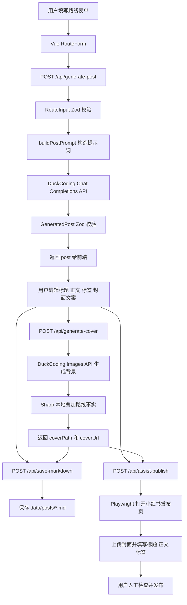
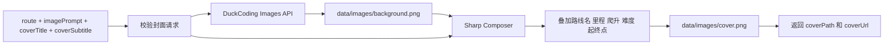

# 成都周边骑行路线发布工具架构重设计

## 1. 目标

本项目重构为一个本地运行的 Web 应用，用于辅助生成成都周边骑行路线的小红书发布素材。用户录入路线信息后，系统完成以下工作：

- 生成结构化小红书文案。
- 生成类似 Strava 风格的封面背景。
- 在本地将路线事实叠加到封面海报。
- 保存最终内容为 Markdown。
- 使用 Playwright 辅助填写小红书桌面端发布页面。

系统不自动发布内容，不保存小红书账号密码，不绕过登录、验证码或平台风控。

## 2. 架构原则

- 前端只负责表单、预览、编辑、状态展示和 API 调用，不承载业务规则。
- 领域模型使用 Zod 统一校验，包括路线输入、生成文案、封面请求和发布请求。
- AI 调用、图片合成、文件保存、浏览器自动化都放在服务层，通过用例层调用。
- 关键路线事实由用户输入和本地渲染控制，不交给图片模型生成。
- DuckCoding OpenAI-compatible API、文件系统、Sharp、Playwright 都隔离在基础设施服务中，便于测试和替换。
- 发布辅助永远不点击最终发布按钮。

## 3. 分层设计

```text
Vue Client
  RouteForm
  GeneratedPostEditor
  CoverPreview
  WorkflowActions
        |
        | HTTP JSON
        v
Express API
  request logging
  request validation
  route handlers
        |
        v
Application Use Cases
  GeneratePostUseCase
  GenerateCoverUseCase
  SaveMarkdownUseCase
  AssistPublishUseCase
        |
        v
Infrastructure Services
  DuckCoding Chat Completions API (OpenAI-compatible)
  DuckCoding Images API (OpenAI-compatible)
  Sharp cover composer
  File system markdown store
  Playwright Xiaohongshu assistant
```

## 4. 建议目录结构

```text
src/
  client/
    App.vue
    api/
      publishingApi.ts
    components/
      RouteForm.vue
      GeneratedPostEditor.vue
      CoverPreview.vue
      WorkflowActions.vue
  server/
    app.ts
    index.ts
    config.ts
    logging/
      requestLogger.ts
    domain/
      routeInput.ts
      generatedPost.ts
      coverPoster.ts
      publishDraft.ts
      promptBuilder.ts
    useCases/
      generatePostUseCase.ts
      generateCoverUseCase.ts
      saveMarkdownUseCase.ts
      assistPublishUseCase.ts
    routes/
      generatePostRoute.ts
      generateCoverRoute.ts
      saveMarkdownRoute.ts
      assistPublishRoute.ts
    services/
      openaiClient.ts
      openaiPostGenerator.ts
      openaiCoverBackgroundGenerator.ts
      coverPosterComposer.ts
      markdownPostStore.ts
      xiaohongshuPublisher.ts
tests/
  domain/
  useCases/
  routes/
  services/
```

## 5. 主流程数据流图



### 5.1 文案生成接口

`/api/generate-post` 使用 DuckCoding 提供的 OpenAI-compatible Chat Completions API。服务层仍使用 OpenAI Node SDK，但必须配置 DuckCoding 的 `baseURL`，并使用 `DUCKCODING_TEXT_API_KEY` 作为文案生成密钥。

```ts
import OpenAI from "openai";

const client = new OpenAI({
  baseURL: process.env.DUCKCODING_BASE_URL ?? "https://www.duckcoding.ai/v1",
  apiKey: process.env.DUCKCODING_TEXT_API_KEY,
});

const completion = await client.chat.completions.create({
  model: process.env.DUCKCODING_TEXT_MODEL ?? "gpt-5.5",
  messages: [{ role: "user", content: buildPostPrompt(route) }],
});

const content = completion.choices[0]?.message?.content;
```

调用约束：

- `messages[0].content` 使用 `buildPostPrompt(route)` 构造，要求模型输出纯 JSON，不输出 Markdown 或解释文字。
- `content` 必须先解析为 JSON，再用 `GeneratedPost` Zod schema 校验。
- 如果 `content` 为空、不是合法 JSON、或不符合 schema，接口返回 `502` 上游生成失败。
- 默认文案模型为 `gpt-5.5`，可通过 `DUCKCODING_TEXT_MODEL` 覆盖。
- 文案生成不得使用图片生成 key；`DUCKCODING_TEXT_API_KEY` 缺失时，`/api/generate-post` 返回上游配置错误。

## 6. 封面生成数据流图



### 6.1 图片生成接口

封面背景生成使用 DuckCoding 提供的 OpenAI-compatible Images API。服务层仍使用 OpenAI Node SDK，但图片客户端必须配置 DuckCoding 的 `baseURL`，并使用 `DUCKCODING_IMAGE_API_KEY` 作为图片生成密钥。

```ts
import OpenAI from "openai";

const client = new OpenAI({
  baseURL: process.env.DUCKCODING_BASE_URL ?? "https://www.duckcoding.ai/v1",
  apiKey: process.env.DUCKCODING_IMAGE_API_KEY,
});

const response = await client.images.generate({
  model: process.env.DUCKCODING_IMAGE_MODEL ?? "gpt-image-1",
  prompt,
  size: process.env.DUCKCODING_IMAGE_SIZE ?? "1024x1536",
  n: 1,
});
```

调用约束：

- `prompt` 来自 `GeneratedPost.imagePrompt`，并追加“无最终中文文字、无可读标签、无数字、水印或 UI 文本”等约束。
- 图片接口只负责生成背景图，路线名、里程、爬升、难度、起终点等关键事实必须由本地 Sharp 合成。
- 默认模型为 `gpt-image-1`，默认背景生成尺寸为 `1024x1536`，默认生成数量为 `1`。
- 本地 Sharp 最终合成海报固定输出为小红书常用竖图尺寸 `1080x1440`，比例为 `3:4`。
- 如果响应包含 `b64_json`，服务层直接写入 `data/images/background-*.png`；如果响应包含图片 URL，服务层下载后再写入本地文件。
- 图片生成不得使用文案生成 key；`DUCKCODING_IMAGE_API_KEY` 缺失时，`/api/generate-cover` 返回上游配置错误。

## 7. 核心领域模型

### 7.1 RouteInput

| 字段 | 类型 | 必填 | 规则 |
|---|---:|---:|---|
| `routeName` | string | 是 | 非空 |
| `startPoint` | string | 是 | 非空 |
| `endPoint` | string | 是 | 非空 |
| `distanceKm` | number | 是 | 大于 0 |
| `elevationGainM` | number | 是 | 大于等于 0 |
| `difficulty` | string | 是 | 非空 |
| `roadType` | string | 是 | 非空 |
| `highlights` | string[] | 是 | 至少 1 项，清洗空白项 |
| `warnings` | string[] | 是 | 至少 1 项，清洗空白项 |
| `supplyPoints` | string[] | 是 | 至少 1 项，清洗空白项 |
| `bestSeason` | string | 否 | 非空字符串 |
| `bestStartTime` | string | 否 | 非空字符串 |
| `targetRiders` | string | 否 | 非空字符串 |
| `transportation` | string | 否 | 非空字符串 |
| `estimatedDuration` | string | 否 | 非空字符串 |
| `photoSpots` | string[] | 否 | 清洗空白项 |
| `foodRecommendations` | string[] | 否 | 清洗空白项 |
| `userHashtags` | string[] | 否 | 清洗空白项 |
| `extraNotes` | string | 否 | 非空字符串 |

### 7.2 GeneratedPost

| 字段 | 类型 | 必填 | 说明 |
|---|---:|---:|---|
| `titleCandidates` | string[] | 是 | 3 个标题候选 |
| `body` | string | 是 | 小红书正文 |
| `guide` | string | 是 | 路线攻略 |
| `easterEgg` | string | 是 | 路线彩蛋 |
| `hashtags` | string[] | 是 | 话题标签，至少 3 个 |
| `coverTitle` | string | 是 | 封面主标题 |
| `coverSubtitle` | string | 是 | 封面副标题 |
| `imagePrompt` | string | 是 | 无最终中文文字的背景图提示词 |

## 8. 前端 GUI 设计

### 8.1 设计目标

前端是本地工作台界面，不做营销落地页。用户进入页面后应直接看到路线录入、生成结果和操作按钮。界面应服务于反复录入、检查、编辑和发布辅助，重点是清晰、密集、稳定和可扫描。

设计目标：

- 让用户快速录入完整路线事实。
- 让 AI 生成结果可预览、可编辑、可保存。
- 明确展示当前流程状态，避免重复点击导致重复消耗上游 AI 额度。
- 让封面生成和发布辅助成为显式动作。
- 所有错误都在当前页面可见，并保留后端终端日志作为排查依据。

### 8.2 页面布局

推荐使用两栏工作台布局：

```text
┌──────────────────────────────────────────────────────────────┐
│ 顶部标题栏：成都骑行路线发布工具 / 当前状态 / 健康检查状态      │
├──────────────────────────────────────┬───────────────────────┤
│ 左侧主区域                             │ 右侧操作侧栏            │
│                                      │                       │
│ RouteForm 路线录入表单                 │ CoverPreview 封面预览   │
│                                      │ WorkflowActions 按钮组  │
│ GeneratedPostEditor 生成内容编辑区      │ Markdown 保存状态       │
│                                      │ 发布辅助状态            │
└──────────────────────────────────────┴───────────────────────┘
```

移动端或窄屏时改为单列：

```text
顶部标题栏
RouteForm
WorkflowActions
CoverPreview
GeneratedPostEditor
状态提示
```

### 8.3 组件职责

| 组件 | 职责 | 不负责 |
|---|---|---|
| `App.vue` | 维护页面状态、串联工作流、处理错误和加载状态 | 具体字段渲染、业务校验细节 |
| `RouteForm.vue` | 录入路线信息，将 textarea 转为字符串数组 | 调用 API、生成提示词 |
| `GeneratedPostEditor.vue` | 展示并编辑 AI 生成结果、选择标题 | 调用上游 AI、保存文件 |
| `CoverPreview.vue` | 展示封面图、封面加载状态、封面错误 | 生成封面 |
| `WorkflowActions.vue` | 展示操作按钮和禁用状态 | 保存业务状态 |
| `publishingApi.ts` | 封装前端 API 请求、统一解析错误 | 页面渲染 |

### 8.4 路线表单设计

路线表单分组展示，避免所有字段堆在一起。

| 分组 | 字段 |
|---|---|
| 基础路线 | 路线名称、起点、终点或折返点 |
| 数据指标 | 总里程、累计爬升、难度、路况类型 |
| 必填内容 | 路线亮点、风险提醒和安全注意事项、补给点 |
| 推荐信息 | 推荐季节、推荐出发时间、适合人群、交通建议、预计耗时 |
| 补充内容 | 拍照点、美食推荐、用户指定话题标签、其他补充说明 |

列表类字段使用 textarea，每行一项：

- 路线亮点
- 风险提醒和安全注意事项
- 补给点
- 拍照点
- 美食推荐
- 用户指定话题标签

数字字段使用 number input：

- `distanceKm`：允许小数，最小值大于 0。
- `elevationGainM`：整数，最小值 0。

### 8.5 生成内容编辑区

`GeneratedPostEditor` 在 `/api/generate-post` 成功后显示。内容必须允许用户编辑，避免 AI 生成结果未经审核直接进入保存或发布流程。

| 区块 | 控件 | 说明 |
|---|---|---|
| 标题候选 | 单选列表或分段控件 | 从 3 个标题中选择一个作为 `selectedTitle` |
| 正文 | textarea | 可编辑小红书正文 |
| 攻略 | textarea | 可编辑路线攻略 |
| 彩蛋 | textarea | 可编辑路线彩蛋 |
| 话题标签 | 标签输入或 textarea | 支持增删标签 |
| 封面文字 | input | `coverTitle` 和 `coverSubtitle` |
| 图片提示词 | textarea | 可编辑 `imagePrompt`，用于封面背景生成 |

### 8.6 封面预览区

`CoverPreview` 固定在右侧侧栏顶部，便于用户在生成和编辑过程中持续看到封面状态。

| 状态 | 展示 |
|---|---|
| 未生成 | 空状态，占位文字为“尚未生成封面” |
| 生成中 | loading 状态，按钮禁用 |
| 成功 | 显示封面图片，展示 `coverPath` |
| 失败 | 显示错误摘要，详情来自 API `detail` |

封面图建议使用稳定比例容器：

```text
宽高比：3:4 或 1080:1440
最大宽度：侧栏宽度
背景：浅灰
```

### 8.7 操作按钮和启用规则

| 按钮 | 启用条件 | 调用 API | 成功后 |
|---|---|---|---|
| AI 生成 | 路线表单基础校验通过，且无其他请求进行中 | `/api/generate-post` | 填充生成内容，清空旧封面和 Markdown 路径 |
| 生成封面海报 | 已有 `GeneratedPost`，且无其他请求进行中 | `/api/generate-cover` | 更新 `coverPath` |
| 保存 Markdown | 已有 `GeneratedPost`，且无其他请求进行中 | `/api/save-markdown` | 展示 `markdownPath` |
| 辅助发布 | 已有 `GeneratedPost`、`selectedTitle`、`coverPath`，且无其他请求进行中 | `/api/assist-publish` | 展示辅助发布已启动 |

所有按钮请求期间必须禁用，避免重复请求造成重复扣费或重复写文件。

### 8.8 页面状态模型

前端推荐维护以下状态：

```ts
type LoadingAction = "" | "generatePost" | "generateCover" | "saveMarkdown" | "assistPublish";

type PageState = {
  route: RouteFormValue;
  generatedPost: GeneratedPost | null;
  selectedTitle: string;
  coverPath: string;
  markdownPath: string;
  loadingAction: LoadingAction;
  errorMessage: string;
  errorDetail?: string;
};
```

错误展示规则：

- `errorMessage` 显示在页面顶部。
- `errorDetail` 可折叠展示，便于复制排查。
- API 返回 `detail` 时必须展示。
- 不在前端展示 API key、authorization、cookie 等敏感信息。

### 8.9 视觉风格

界面应偏工作台，不做大面积 hero 或营销视觉。

建议风格：

- 背景使用浅灰或白色。
- 面板边框使用低对比度灰色。
- 主按钮使用骑行/运动感的橙色或红橙色。
- 表单布局紧凑，字段标签清晰。
- 卡片圆角不超过 8px。
- 避免大面积渐变、装饰性图形和纯视觉占位。
- 文字大小按工作台密度控制，标题不过度放大。

### 8.10 前端 API 错误处理

`publishingApi.ts` 统一处理响应：

- 成功时返回 JSON。
- 失败时读取 `{ error, detail, issues }`。
- 抛出包含 `message` 和 `detail` 的前端错误对象。

前端显示优先级：

```text
detail 存在：显示 error + detail
detail 不存在：显示 error
error 不存在：显示“请求失败”
```

## 9. API 定义

### 9.1 API 总览

| API | 方法 | 作用 | 成功响应 | 主要失败 |
|---|---|---|---|---|
| `/api/health` | GET | 健康检查 | `{ ok: true }` | 无 |
| `/api/generate-post` | POST | 根据路线生成小红书文案和封面提示词 | `{ post }` | `400` 输入错误，`502` AI 错误 |
| `/api/generate-cover` | POST | 使用 DuckCoding Images API 生成封面背景并本地合成海报 | `{ coverPath, coverUrl }` | `400` 输入错误，`502` 图片生成失败，`500` 合成失败 |
| `/api/save-markdown` | POST | 保存最终内容为 Markdown | `{ markdownPath }` | `400` 输入错误，`500` 写入失败 |
| `/api/assist-publish` | POST | 启动小红书发布辅助 | `{ ok: true }` | `400` 输入错误，`500` 浏览器自动化失败 |

### 9.2 GET `/api/health`

响应：

| 字段 | 类型 | 说明 |
|---|---:|---|
| `ok` | boolean | 服务是否可用 |

示例：

```json
{
  "ok": true
}
```

### 9.3 POST `/api/generate-post`

请求体：`RouteInput`

响应：

| 字段 | 类型 | 说明 |
|---|---:|---|
| `post` | GeneratedPost | 生成后的结构化小红书内容 |

示例：

```json
{
  "post": {
    "titleCandidates": ["成都周末骑到青城山", "82km 青城山骑行", "成都周边骑行路线"],
    "body": "这条路线适合想要一点爬升和风景的周末骑行。",
    "guide": "建议早上出发，注意返程车流。",
    "easterEgg": "沿途可以留意河边视野好的转角。",
    "hashtags": ["成都骑行", "成都周边游", "路线攻略"],
    "coverTitle": "成都到青城山",
    "coverSubtitle": "82km / 620m",
    "imagePrompt": "Strava-like cycling poster background, no text"
  }
}
```

### 9.4 POST `/api/generate-cover`

请求参数：

| 字段 | 类型 | 必填 | 说明 |
|---|---:|---:|---|
| `route` | RouteInput | 是 | 用于本地叠加路线事实 |
| `imagePrompt` | string | 是 | 背景图提示词 |
| `coverTitle` | string | 是 | 海报主标题 |
| `coverSubtitle` | string | 是 | 海报副标题 |

响应：

| 字段 | 类型 | 说明 |
|---|---:|---|
| `coverPath` | string | 生成后的本地封面 PNG 路径 |
| `coverUrl` | string | 前端可直接加载的封面访问路径 |

示例：

```json
{
  "coverPath": "data/images/2026-06-01-cover.png",
  "coverUrl": "/generated-images/2026-06-01-cover.png"
}
```

### 9.5 POST `/api/save-markdown`

请求参数：

| 字段 | 类型 | 必填 | 说明 |
|---|---:|---:|---|
| `route` | RouteInput | 是 | 路线事实 |
| `post` | GeneratedPost | 是 | 生成并编辑后的内容 |
| `selectedTitle` | string | 是 | 用户选定标题 |
| `coverPath` | string | 否 | 已生成封面路径 |

响应：

| 字段 | 类型 | 说明 |
|---|---:|---|
| `markdownPath` | string | 保存后的 Markdown 文件路径 |

Markdown 保存目录：

```text
data/posts/
```

文件名规则：

```text
YYYY-MM-DD-HHmm-<route-name-slug>.md
```

### 9.6 POST `/api/assist-publish`

请求参数：

| 字段 | 类型 | 必填 | 说明 |
|---|---:|---:|---|
| `title` | string | 是 | 小红书标题 |
| `body` | string | 是 | 正文内容 |
| `hashtags` | string[] | 是 | 话题标签 |
| `coverPath` | string | 是 | 要上传的封面图片路径 |

响应：

| 字段 | 类型 | 说明 |
|---|---:|---|
| `ok` | boolean | 是否成功启动辅助发布流程 |

示例：

```json
{
  "ok": true
}
```

## 10. 错误响应格式

所有 API 使用统一错误格式：

```ts
type ApiError = {
  error: string;
  detail?: string;
  issues?: unknown;
};
```

错误状态码约定：

| 状态码 | 场景 |
|---:|---|
| `400` | 本地输入校验失败 |
| `502` | DuckCoding 等上游服务失败 |
| `500` | 文件系统、图片合成、Playwright 等本地执行失败 |

示例：

```json
{
  "error": "Failed to generate cover background",
  "detail": "Billing hard limit has been reached"
}
```

## 11. 用例边界

### 11.1 GeneratePostUseCase

输入：`RouteInput`

输出：`GeneratedPost`

职责：

- 校验路线输入。
- 构造小红书文案提示词。
- 调用 DuckCoding Chat Completions API。
- 校验 AI 返回的 JSON 结构。

不负责：

- 页面状态。
- Markdown 保存。
- 封面图片生成。

### 11.2 GenerateCoverUseCase

输入：`route`、`imagePrompt`、`coverTitle`、`coverSubtitle`

输出：`coverPath`、`coverUrl`

职责：

- 调用 DuckCoding Images API 生成无最终中文文字的封面背景。
- 使用本地程序叠加路线事实。
- 输出 PNG 文件路径和前端可访问路径。

不负责：

- 生成小红书正文。
- 保存 Markdown。
- 发布到小红书。

### 11.3 SaveMarkdownUseCase

输入：`route`、`post`、`selectedTitle`、`coverPath`

输出：`markdownPath`

职责：

- 序列化最终内容。
- 保存到 `data/posts/`。
- 返回本地文件路径。

### 11.4 AssistPublishUseCase

输入：`title`、`body`、`hashtags`、`coverPath`

输出：`ok`

职责：

- 打开小红书桌面端发布页。
- 上传封面图片。
- 填写标题、正文和标签。
- 停留在最终发布前。

不负责：

- 登录账号。
- 处理验证码。
- 点击最终发布按钮。

## 12. 测试策略

| 层级 | 测试重点 |
|---|---|
| domain | Zod schema、提示词是否保留路线事实、AI 输出 schema |
| useCases | 用例编排、错误分支、依赖替换 |
| routes | HTTP 状态码、请求校验、响应格式 |
| services | DuckCoding OpenAI-compatible 请求包装、Sharp 输出、Markdown 文件、Playwright 行为边界 |
| client | 表单转换、按钮状态、错误展示、生成结果编辑 |

测试原则：

- 领域逻辑和 API 行为先写测试。
- DuckCoding 等上游 AI 服务不在单元测试中真实调用。
- Playwright 发布辅助使用假的 browser/page 抽象测试。
- 图片合成服务可以使用小尺寸测试图验证输出文件存在和格式正确。

## 13. 日志规范

后端日志使用 JSON Lines 格式。每条日志占一行，便于终端查看，也便于后续接入文件采集或结构化分析。

### 13.1 日志格式

```json
{
  "time": "2026-06-01T12:00:00.000Z",
  "level": "info",
  "event": "api.request.completed",
  "requestId": "req_01hxyz",
  "method": "POST",
  "path": "/api/generate-post",
  "status": 200,
  "durationMs": 1234
}
```

### 13.2 通用字段

| 字段 | 类型 | 必填 | 说明 |
|---|---:|---:|---|
| `time` | string | 是 | ISO 8601 时间 |
| `level` | string | 是 | `debug`、`info`、`warn`、`error` |
| `event` | string | 是 | 事件名，使用点分命名 |
| `requestId` | string | 否 | 单次前端 API 请求的关联 ID |
| `durationMs` | number | 否 | 耗时，单位毫秒 |
| `message` | string | 否 | 人类可读说明 |
| `error` | object | 否 | 错误详情 |

### 13.3 API 请求日志字段

| 字段 | 类型 | 必填 | 说明 |
|---|---:|---:|---|
| `method` | string | 是 | HTTP 方法 |
| `path` | string | 是 | 请求路径，不包含 query 中的敏感信息 |
| `status` | number | 是 | HTTP 响应状态码 |
| `requestHeaders` | object | 否 | 请求头，经过脱敏 |
| `requestBody` | object | 否 | 请求体，经过脱敏和长度限制 |
| `responseBody` | object | 否 | 响应体摘要，错误时必须记录 |

### 13.4 AI 调用日志字段

| 字段 | 类型 | 必填 | 说明 |
|---|---:|---:|---|
| `provider` | string | 是 | `duckcoding` |
| `operation` | string | 是 | `chat.completions.create` 或 `images.generate` |
| `model` | string | 是 | 使用的模型名 |
| `status` | number | 否 | 上游 HTTP 状态码 |
| `requestHeaders` | object | 否 | 发送给上游接口的请求头，经过脱敏 |
| `requestBody` | object | 否 | 发送给上游接口的请求体，经过脱敏和长度限制 |
| `responseSummary` | object | 否 | 响应摘要，不记录完整大文本或 base64 图片 |

### 13.5 事件名约定

| 事件名 | level | 触发时机 |
|---|---|---|
| `api.request.started` | `info` | 收到前端 API 请求 |
| `api.request.completed` | `info` | API 请求成功或业务错误返回 |
| `api.request.failed` | `error` | API 请求出现未处理异常 |
| `openai.request.started` | `info` | 准备调用 DuckCoding OpenAI-compatible 上游 |
| `openai.request.completed` | `info` | DuckCoding OpenAI-compatible 上游调用成功 |
| `openai.request.failed` | `error` | DuckCoding OpenAI-compatible 上游调用失败 |
| `cover.compose.started` | `info` | 开始本地合成封面 |
| `cover.compose.completed` | `info` | 本地封面合成成功 |
| `cover.compose.failed` | `error` | 本地封面合成失败 |
| `markdown.save.completed` | `info` | Markdown 保存成功 |
| `publish.assist.started` | `info` | 启动小红书辅助发布 |
| `publish.assist.completed` | `info` | 填写动作完成，等待用户人工发布 |
| `publish.assist.failed` | `error` | Playwright 自动化失败 |

### 13.6 脱敏和长度限制

必须脱敏：

- `DUCKCODING_TEXT_API_KEY`
- `DUCKCODING_IMAGE_API_KEY`
- HTTP headers 中的 `authorization`
- cookie
- 小红书账号、手机号、验证码
- 本地浏览器 profile 中的敏感路径细节

建议长度限制：

| 内容 | 最大长度 | 处理方式 |
|---|---:|---|
| 请求头 | 4 KB | 脱敏后记录，超出后截断 |
| API 请求体 | 8 KB | 超出后截断并添加 `truncated: true` |
| AI prompt | 8 KB | 超出后截断并添加 `truncated: true` |
| AI 文本响应 | 4 KB | 只记录摘要 |
| 图片 base64 | 0 | 禁止记录 |

请求头脱敏规则：

| Header | 记录方式 |
|---|---|
| `authorization` | 固定记录为 `[redacted]` |
| `cookie` | 固定记录为 `[redacted]` |
| `set-cookie` | 固定记录为 `[redacted]` |
| `x-api-key` | 固定记录为 `[redacted]` |
| `openai-organization` | 可记录 |
| `content-type` | 可记录 |
| `content-length` | 可记录 |
| `user-agent` | 可记录 |
| 其他 header | 默认可记录，但值长度超过 512 字符时截断 |

请求体记录规则：

- API 请求体默认记录完整 JSON，但必须应用 8 KB 限制。
- DuckCoding 请求体可以记录 `model`、`messages`、`prompt`、`size`、`n` 等调试必要字段。
- DuckCoding 图片响应中的 `b64_json` 禁止记录。
- 文件上传、Buffer、ArrayBuffer、Blob、FormData 只记录类型、字段名和大小，不记录二进制内容。
- 任何包含 `apiKey`、`password`、`token`、`secret`、`code` 的字段名必须脱敏。

### 13.7 示例日志

API 请求开始：

```json
{"time":"2026-06-01T12:00:00.000Z","level":"info","event":"api.request.started","requestId":"req_01","method":"POST","path":"/api/generate-post","requestHeaders":{"content-type":"application/json","user-agent":"Mozilla/5.0"},"requestBody":{"routeName":"成都到青城山周末骑行","distanceKm":82}}
```

DuckCoding 文案生成调用失败：

```json
{"time":"2026-06-01T12:00:01.000Z","level":"error","event":"openai.request.failed","requestId":"req_01","provider":"duckcoding","operation":"chat.completions.create","model":"gpt-5.5","requestHeaders":{"authorization":"[redacted]","content-type":"application/json"},"requestBody":{"model":"gpt-5.5","messages":[{"role":"user","content":"你是成都周边骑行路线的小红书内容策划..."}]},"durationMs":913,"error":{"name":"Error","message":"Billing hard limit has been reached"}}
```

DuckCoding 图片生成请求：

```json
{"time":"2026-06-01T12:00:02.000Z","level":"info","event":"openai.request.started","requestId":"req_02","provider":"duckcoding","operation":"images.generate","model":"gpt-image-1","requestHeaders":{"authorization":"[redacted]","content-type":"application/json"},"requestBody":{"model":"gpt-image-1","prompt":"Strava-like cycling poster background, no final Chinese text...","size":"1024x1536","n":1}}
```

API 错误返回：

```json
{"time":"2026-06-01T12:00:01.010Z","level":"info","event":"api.request.completed","requestId":"req_01","method":"POST","path":"/api/generate-post","status":502,"durationMs":1022,"responseBody":{"error":"Billing hard limit has been reached"}}
```

## 14. 环境变量

| 变量 | 必填 | 说明 |
|---|---:|---|
| `PORT` | 否 | 后端端口，默认 `8787` |
| `DUCKCODING_BASE_URL` | 否 | DuckCoding API 地址，默认 `https://www.duckcoding.ai/v1` |
| `DUCKCODING_TEXT_API_KEY` | 是 | DuckCoding Chat Completions API key，用于 `/api/generate-post` |
| `DUCKCODING_TEXT_MODEL` | 否 | 文案生成模型，默认 `gpt-5.5` |
| `DUCKCODING_IMAGE_API_KEY` | 是 | DuckCoding Images API key，用于 `/api/generate-cover` |
| `DUCKCODING_IMAGE_MODEL` | 否 | 图片生成模型，默认 `gpt-image-1` |
| `DUCKCODING_IMAGE_SIZE` | 否 | 背景图生成尺寸，默认 `1024x1536`；最终海报输出固定为 `1080x1440` |
| `HTTP_PROXY` | 否 | HTTP 代理 |
| `HTTPS_PROXY` | 否 | HTTPS 代理 |
| `ALL_PROXY` | 否 | 通用代理 |
| `XIAOHONGSHU_PUBLISH_URL` | 否 | 小红书发布入口 |

## 15. 关键风险

- DuckCoding 额度、hard limit 或模型权限限制会导致文案或封面生成失败。
- 图片生成成本较高，必须由用户显式点击触发。
- 小红书页面结构变化可能导致 Playwright 选择器失效。
- 用户输入不完整会影响 AI 生成质量，因此必填字段必须严格校验。
- 图片模型可能生成错误文字，因此最终中文和关键数字必须由本地程序叠加。
